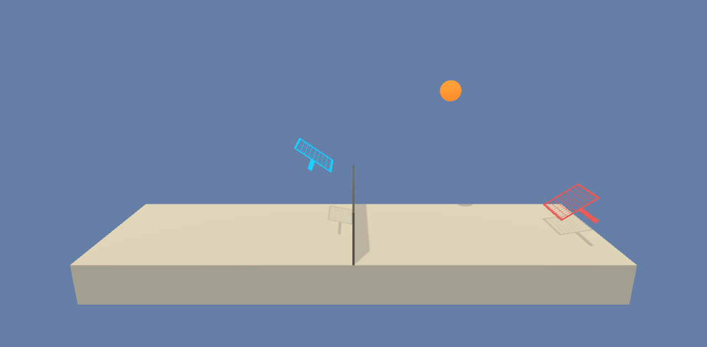

# MADDPG For Collaboration and Competition

The goal of this project is to solve the [Collaboration and Competition](https://github.com/udacity/deep-reinforcement-learning/tree/master/p3_collab-compet) challenge from the [Deep Reinforcement Learning Nanodegree](https://www.udacity.com/course/deep-reinforcement-learning-nanodegree--nd893) program.

Random Agent        | Trained Agent
:------------------:|:-----------------------:
 | 

### Required Libraries

The following libraries and dependencies are used:

1. [Python 3.6](https://www.python.org/downloads/)
2. [Unity ML-Agents](https://github.com/Unity-Technologies/ml-agents/blob/master/docs/Installation.md)
3. [NumPy](http://www.numpy.org/)
4. [Pytorch 1.3](https://pytorch.org/)

#### The following files have been defined:

1. agent.py : Contains the implementation of Random, DDPG agents and MADDPG.
2. model.py : Contains the Actor and Critic models used by the DDPG agents.
3. noise.py : Contains the implementation of the Ornstein–Uhlenbeck noise.
3. coach.py : Contains a function to run the environment with a specified agent and define the structure to learn from the environment.

### The Environment

The compiled environment can be downloaded from the following links:

- [Linux](https://s3-us-west-1.amazonaws.com/udacity-drlnd/P3/Tennis/Tennis_Linux.zip)
- [Mac OSX](https://s3-us-west-1.amazonaws.com/udacity-drlnd/P3/Tennis/Tennis.app.zip)
- [Windows (32-bit)](https://s3-us-west-1.amazonaws.com/udacity-drlnd/P3/Tennis/Tennis_Windows_x86.zip)
- [Windows (64-bit)](https://s3-us-west-1.amazonaws.com/udacity-drlnd/P3/Tennis/Tennis_Windows_x86_64.zip)

#### Observation and Action Space

The environment consists of two agents (represented as rackets) that can be controlled to play a tennis-like game. Each agent receives a reward of +0.1 if it hits the ball while receives a penality of -0.01 when the ball hits the ground on its territory. To maximise the environment reward, both agent should try to keep the ball in play as long as possible.

Each agent observation is defined by 8 variables corresponding to the position and velocity of the ball and its racket. The ensemble of the two observations will be called "state" here since it has all the information required to re-create the current state.

Actions are continious and are defined by two variables, one to move toward/away from the net and one to jump.

The episode score is defined as the maximum score of the 2 agents. The environment is considered solved if this score reaches +0.5 over 100 consecutive episodes.

#### MADDPG

The agents will be trained using a [Multi-Agent Actor-Critic for Mixed Cooperative-Competitive Environments](https://arxiv.org/abs/1706.02275) on [Deep Deterministic Policy Gradients (DDPG) agents](https://arxiv.org/abs/1509.02971).

Agents have access to the full state (all observations) during training, but only their own observation during deployment/test phase as per MADDPG architecture defined by [Lowe et al., 2017](https://arxiv.org/abs/1706.02275) :

  

### Ideas for future work
1. We could do an hyperparameters tuning to train the agents in less epochs.
  
2. Some of the code for the learning part could be optimized to run faster.
  
3. Since each agent is the reflexion of the other, we could increase the replay memory by a factor of 2.
  
4. Since the reward is really sparse at the beginning, we could try different noise functions that would provide a better result at the begginning, but this might be environment specific...
  
5. The reward function could maybe be adjusted to give a bonus for how close the racket is from the ball. The model could then start to learn to go near the ball earlier without trial and error as the current implementation is doing.
  
6. We could adapt the code to train on the [soccer environment](https://github.com/Unity-Technologies/ml-agents/blob/master/docs/Learning-Environment-Examples.md).
